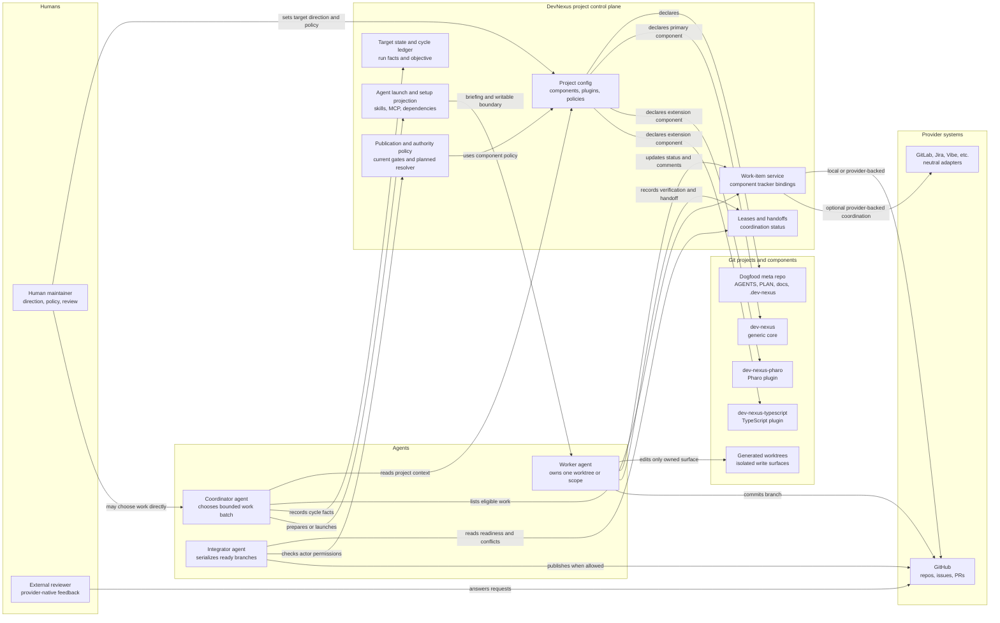
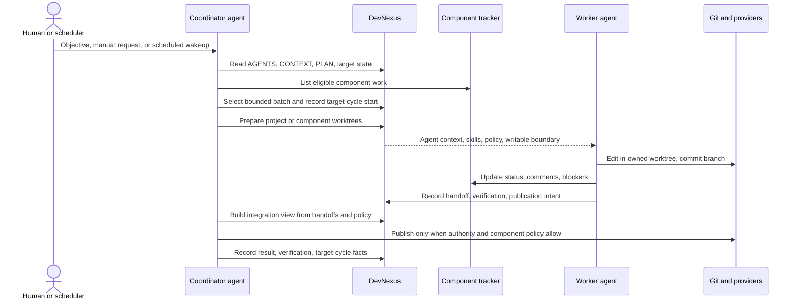
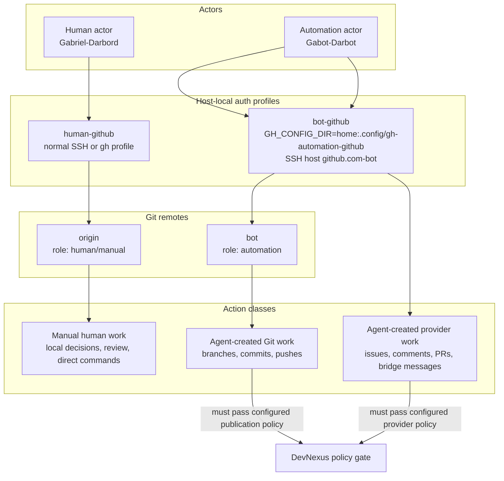
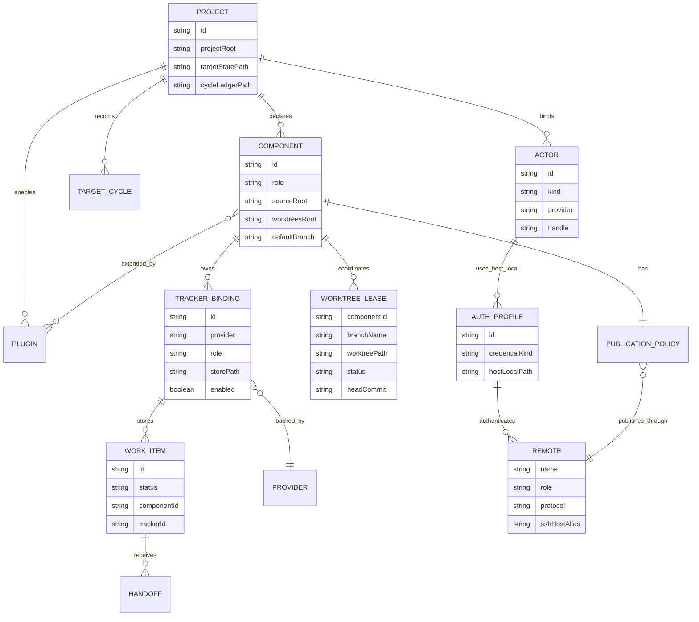

# DevNexus Operating Model

DevNexus is the project control plane around one or more component repositories.
It records durable facts, exposes safe tooling, projects agent setup, and gates
mutations. Humans and coordinator agents still choose what work to do and how to
supervise it.

## System Map

## Target Cycle

## Account And Remote Model

Rule of thumb: human account defaults are for manual human actions. Any
agent-created Git or provider mutation must use the configured automation actor
unless the user explicitly overrides that policy.

## Conceptual Schema

## Core Entities

| Entity | What It Owns | Current Dogfood Shape |
| --- | --- | --- |
| DevNexus project | Portable project graph, target state, automation policy, skills, MCP wiring, worktree roots, local work-item stores | `dev-nexus-dogfood` |
| Component | Source root, generated worktree root, tracker bindings, verification policy, publication policy | `dev-nexus`, `dev-nexus-pharo`, `dev-nexus-typescript` |
| Tracker binding | Component-scoped system of record for work items, comments, status, labels, and provider references | Local JSON stores under `.dev-nexus/work-items/` |
| Worktree lease | Advisory ownership record for one active agent surface | Records component or project-meta scope, branch, status, verification, handoff |
| Target cycle | One coordinator run against the target objective | Records selected work, blockers, verification, publication, result JSON |
| Actor and auth profile | Who is attempting an action and which host-local credential profile is used | Human `Gabriel-Darbord`; automation `Gabot-Darbot` |
| Publication policy | Whether and how verified changes may be published | Direct integration to `main` through `bot` where component policy allows |
| Plugin | Additive setup policy, skills, MCP wiring, and domain affordances | Pharo and TypeScript plugins extend the generic core |

## Current Dogfood Instance

| Scope | Source Root | Tracker | Publication |
| --- | --- | --- | --- |
| Meta project | `/Users/gabriel.darbord/dev-nexus/dev-nexus-dogfood` | Project-local DevNexus state | `bot` remote to `main` for automation; `origin` for manual human work |
| `dev-nexus` | `/Users/gabriel.darbord/dev-nexus/sources/dev-nexus` | `.dev-nexus/work-items/dev-nexus.json` | Direct integration through component `bot` remote |
| `dev-nexus-pharo` | `/Users/gabriel.darbord/dev-nexus/sources/dev-nexus-pharo` | `.dev-nexus/work-items/dev-nexus-pharo.json` | Direct integration through component `bot` remote |
| `dev-nexus-typescript` | `/Users/gabriel.darbord/dev-nexus/sources/dev-nexus-typescript` | `.dev-nexus/work-items/dev-nexus-typescript.json` | Direct integration through component `bot` remote |

## Operating Invariants

- DevNexus records facts and applies guardrails; it does not choose or supervise
  implementation work.
- Each component owns its source root, worktree root, tracker, verification
  policy, and publication policy.
- Shared checkouts are read-mostly control rooms. Mutating agent work belongs in
  an owned generated worktree or an explicit integration context.
- Work selection uses component trackers. Local stores are fast for dogfood;
  provider-backed trackers are the path for durable shared coordination.
- Agent-created Git and provider activity uses the automation profile and must
  pass configured publication, provider, and evolving authority policy before
  mutation.
- Handoffs, leases, verification summaries, target-cycle facts, and publication
  decisions are the durable continuation record, not chat transcript memory.
