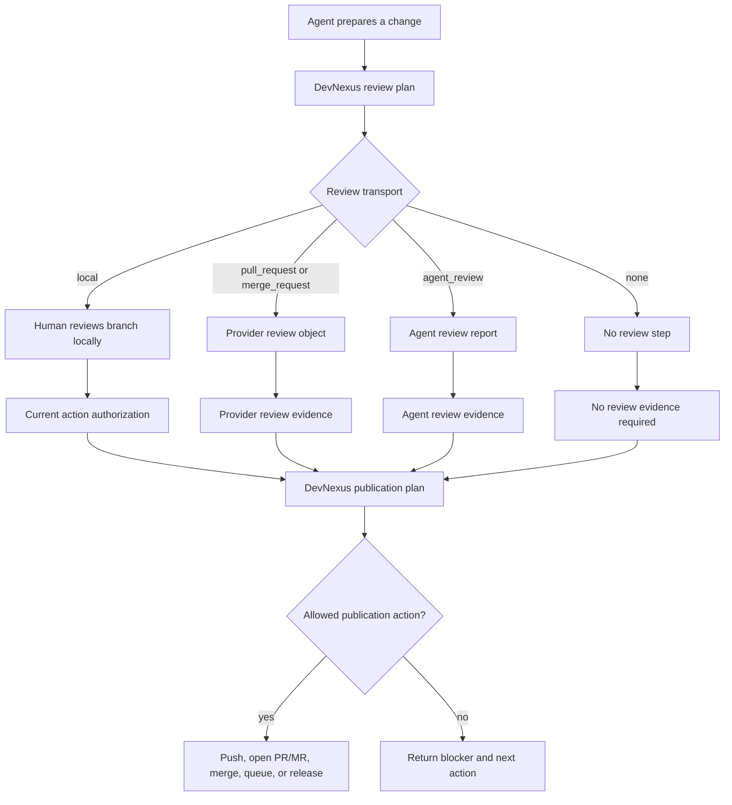
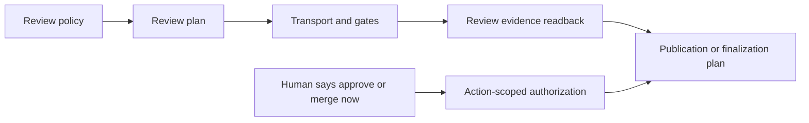
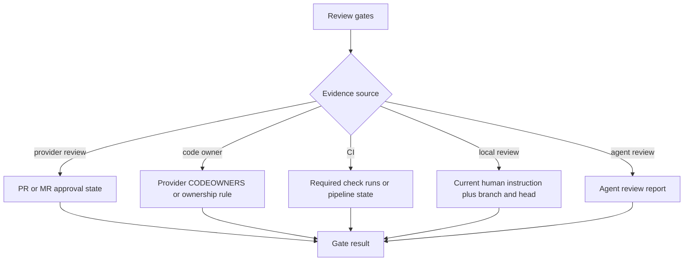

# Review Policy Design

This note records the DevNexus review policy model and the first implemented
planner surface.

## Goal

DevNexus should let each component say how changes are reviewed without making
agents reason through provider rules by hand.

The practical goal is simple:

- use local review when the human wants to inspect a branch in VS Code;
- use a pull request or merge request when the provider should hold the review
  decision;
- keep GitHub, GitLab, or other providers quiet unless policy says to create a
  provider object;
- let publication tools consume review facts without treating review and merge
  as the same thing.

## Terms

- Review transport: where the review happens. Examples: `local`,
  `pull_request`, `merge_request`, `issue`, `agent_review`, `none`.
- Review gates: requirements that must be satisfied before a change may
  continue. Examples: `human_required`, `provider_approval_required`,
  `code_owner_required`, `ci_required`, `final_human_approval_required`.
- Review plan: the read-only answer from DevNexus that tells the agent which
  transport and gates apply.
- Review evidence: facts DevNexus can read from Git, CI, a provider, or the
  current session.
- Local authorization: the human's permission to take one current action, such
  as "merge this branch now." It is not a committed approval ledger.
- Publication policy: the separate policy that decides whether a change may be
  pushed, opened as a PR/MR, merged, queued, published, or released.

## Prior Art

Provider and review-tool behavior points to a split between review, gate
evaluation, and publication.

- GitHub pull request reviews let reviewers comment, approve, or request
  changes. Protected branches can then require approvals, status checks, linear
  history, and other merge conditions. CODEOWNERS can request or require owners
  for touched paths. Sources: [GitHub pull request reviews](https://docs.github.com/en/pull-requests/collaborating-with-pull-requests/reviewing-changes-in-pull-requests/about-pull-request-reviews),
  [protected branches](https://docs.github.com/en/repositories/configuring-branches-and-merges-in-your-repository/managing-protected-branches/about-protected-branches),
  [CODEOWNERS](https://docs.github.com/en/repositories/managing-your-repositorys-settings-and-features/customizing-your-repository/about-code-owners).
- GitLab models merge request approvals and approval rules separately from
  merge checks such as pipeline status, conflicts, unresolved discussions, and
  required approvals. Sources: [GitLab merge request approvals](https://docs.gitlab.com/user/project/merge_requests/approvals/),
  [approval rules](https://docs.gitlab.com/user/project/merge_requests/approvals/rules/),
  [merge request concepts](https://docs.gitlab.com/development/merge_request_concepts/).
- Gerrit separates review labels from submit requirements. Labels such as
  Code-Review and Verified record votes, while submit requirements decide
  whether a change is submittable. Sources: [Gerrit review labels](https://gerrit-review.googlesource.com/Documentation/config-labels.html),
  [submit requirements](https://gerrit-review.googlesource.com/Documentation/config-submit-requirements.html).
- Stacked-change tools such as Graphite and Sapling make small dependent
  review branches normal, then restack or update them as base branches move.
  Sources: [Graphite stacked PR review](https://graphite.com/docs/best-practices-for-reviewing-stacks),
  [Sapling stack](https://sapling-scm.com/docs/git/sapling-stack/).
- Phabricator's automated landing documentation is a useful warning: review
  approval is not enough if the tool cannot prove what is actually being landed.
  Source: [Phabricator automated landing](https://secure.phabricator.com/book/phabricator/article/differential_land/).

## Model

Review policy produces a plan. It does not publish the change by itself.
Mutating publication commands can consume the same plan when they need to decide
whether a final publication action is allowed.



The important boundary is that local approval authorizes a current action. It
does not create a durable source approval record in the repository. Provider
review objects are already durable records, so DevNexus should read them instead
of copying their state into committed files.



## Enforcement Boundary

DevNexus follows the common provider split between creating a review object and
submitting the change. [GitHub branch protection](https://docs.github.com/en/repositories/configuring-branches-and-merges-in-your-repository/managing-protected-branches/about-protected-branches)
describes required reviews and status checks as merge requirements,
[GitLab merge request approvals](https://docs.gitlab.com/user/project/merge_requests/approvals/)
are checked before merge, and
[Gerrit submit requirements](https://gerrit-review.googlesource.com/Documentation/config-submit-requirements.html)
decide whether a reviewed change is submittable. Review policy enforcement
therefore blocks final publication actions, not the actions that create or
update the review surface.

When a component has no explicit `review` policy, enforcement is a noop. When a
component configures review policy, mutating publication commands use
`final_actions` enforcement:

- Allowed before review is complete: branch pushes to review branches,
  pull-request or merge-request creation, draft updates, and review requests.
- Blocked until the resolved review plan is `ready`: pull-request merge, direct
  target-branch push, package publish, release publish, and final publication
  completion.

## Policy Shape

The review policy should live on the component, separate from publication:

```json
{
  "components": [
    {
      "id": "api",
      "review": {
        "default": {
          "transport": "local",
          "gates": ["human_required"]
        },
        "rules": []
      },
      "publication": {
        "strategy": "review_handoff"
      }
    }
  ]
}
```

Rules are ordered. The first matching rule wins, then omitted fields fall back
to the default.

```json
{
  "review": {
    "default": {
      "transport": "local",
      "gates": ["human_required"]
    },
    "rules": [
      {
        "match": {
          "branchRole": "feature_finalization"
        },
        "transport": "pull_request",
        "gates": [
          "provider_approval_required",
          "ci_required",
          "final_human_approval_required"
        ]
      },
      {
        "match": {
          "paths": ["docs/**", "plugins/**/skills/**"]
        },
        "transport": "local",
        "gates": ["human_required"]
      }
    ]
  }
}
```

## Planner Command

Agents should call the review planner instead of inspecting policy and branching
their own workflow.

```bash
dev-nexus review plan <workspace-root> \
  --component api \
  --path docs/dev/review-policy.md \
  --requested-action merge \
  --branch docs/review-policy \
  --head abc123 \
  --json
```

For local VS Code review, the same command can include action-scoped human
authorization:

```bash
dev-nexus review plan <workspace-root> \
  --component api \
  --path docs/dev/review-policy.md \
  --requested-action merge \
  --branch docs/review-policy \
  --head abc123 \
  --authorized \
  --authorization-timestamp 2026-05-23T10:00:00Z \
  --json
```

Provider review evidence is read from a provider evidence file, using the same
normalized evidence shape as publication and release-train planning:

```bash
dev-nexus review plan <workspace-root> \
  --component api \
  --branch-role feature_finalization \
  --requested-action merge \
  --evidence-file provider-evidence.json \
  --json
```

## Responsibilities

| Area | Question | Writes durable state? |
| --- | --- | --- |
| Review policy | How should this change be reviewed? | No, it returns a plan. |
| Review evidence | What facts satisfy the gates? | No, it reads Git, CI, providers, or the current session. |
| Local authorization | Did the human authorize this exact action now? | No committed source file by default. |
| Publication policy | May this change be pushed, merged, queued, published, or released? | It may write through the selected transport. |
| Comment policy | Should provider comments be written? | Only when configured. |

This keeps normal workflows regular. Agents implement, verify, and call the
review tool. The tool handles policy, provider behavior, and blocked actions.

## Evidence Sources

DevNexus should treat evidence as readback from the place where the review
happened.



For local review, the minimum action context is:

- component id;
- branch name;
- head commit;
- requested action;
- timestamp of the human authorization;
- verification summary used for the decision.

That context should be compared against the current branch and requested action
when DevNexus plans publication. If the branch head or action changed, the tool
should ask for fresh authorization.

## Authorization Ledger Decision

DevNexus does not need a general local review authorization ledger for normal
projects. Provider review records remain canonical where a provider review
object exists. Local authorization stays action-scoped input to the current
publication or finalization decision, not a source-controlled approval file.

The default storage mode is therefore `none`: DevNexus keeps the current
provider-only or current-session behavior and writes no approval records to the
workspace repository. Small projects should stay on this path unless they have
an audit requirement that provider reviews cannot satisfy.

If a project later needs audit-grade local approvals, the ledger should be an
explicit backend policy, not repo JSON. A minimal backend-backed ledger would
be append-only and scoped to the action being authorized:

- `id`: backend-generated unique id.
- `project_id` and `component_id`.
- `requested_action`: for example `pull_request.merge`,
  `target_branch.push`, `release.publish`, or `package.publish`.
- `branch_name`, `head_sha`, optional `target_ref`, and optional provider
  review target such as pull request or merge request number.
- `actor_id`, authority role or provider reviewer identity, and the authority
  source used to accept the decision.
- `decision`: `approved`, `rejected`, or `revoked`.
- `summary` and `verification_summary`: short human-readable context.
- `created_at`, optional `expires_at`, and optional `supersedes_id`.
- Optional `evidence_uri` for provider evidence, CI evidence, or a local review
  artifact that the backend can still read.
- Opaque `metadata` for backend-specific audit fields.

Retention should be explicit on the backend policy. A safe default is "retain
until the project deletes or archives the backend record"; teams with stricter
requirements can choose a fixed period such as one release cycle or one year.
DevNexus should never prune audit records as part of ordinary workspace cleanup.

The auth model should also be explicit. Agents may read ledger state and use it
as review evidence, but they should not grant their own local approvals. Writing
an approval record requires a configured human or service actor with reviewer
or maintainer authority for the requested action. Provider-native approvals
still win when the review transport is `pull_request`, `merge_request`, or
another provider-backed surface; DevNexus should read those provider records
rather than duplicating them into the local ledger.

## Initial DevNexus Behavior

The first implementation is deliberately small:

1. Add component review policy parsing and validation.
2. Add a review-plan command/API that returns transport, gates, required
   evidence, provider mutations, and blocked actions.
3. Add evidence readback for local Git facts, current-session human
   authorization, provider review state, and provider CI/check state.
4. Keep provider comments silent unless comment policy explicitly enables them.

Feature-finalization planning now includes the component review plan when a
review policy is configured. Mutating publication commands enforce configured
review policy for final actions: pull-request merge and direct target-branch
push are blocked until the resolved review plan is ready. Further follow-up work
should expand provider-native readback where needed.

The first implementation should not add committed approval files or a general
approval ledger. The selected ledger posture is noop/provider-only by default.
If a later project needs audit-grade local approvals, implement the
backend-backed policy above as a separate opt-in feature with its own review.

## Examples

Docs and skills reviewed in VS Code:

- Transport: `local`.
- Gates: `human_required`.
- Evidence: branch name, head commit, verification summary, and current human
  authorization for the requested action.
- Provider behavior: no branch push, no pull request, no provider comments.

Feature branch finalization:

- Transport: `pull_request`.
- Gates: `provider_approval_required`, `ci_required`,
  `final_human_approval_required`.
- Evidence: final feature branch, pull request state, review state, required
  checks, base freshness, and conflict status.
- Provider behavior: create or update one final pull request when the feature
  is ready for publication review.

Stacked review branch:

- Transport: `pull_request` or `local`, depending on component policy.
- Gates: normally one human review gate and the relevant focused checks.
- Evidence: stack position, base branch, head commit, restack state, and review
  state for the current branch.
- Provider behavior: avoid extra comments; update the provider object only when
  the policy selected provider review.

## Open Decisions

- Exact gate names and whether `human_required` and
  `final_human_approval_required` should be separate gates or the same gate
  with different actions.
- How much provider-specific detail belongs in the generic review-plan result.
- Whether path ownership should be DevNexus-native, provider-native only, or a
  provider-first model with optional local ownership rules.
