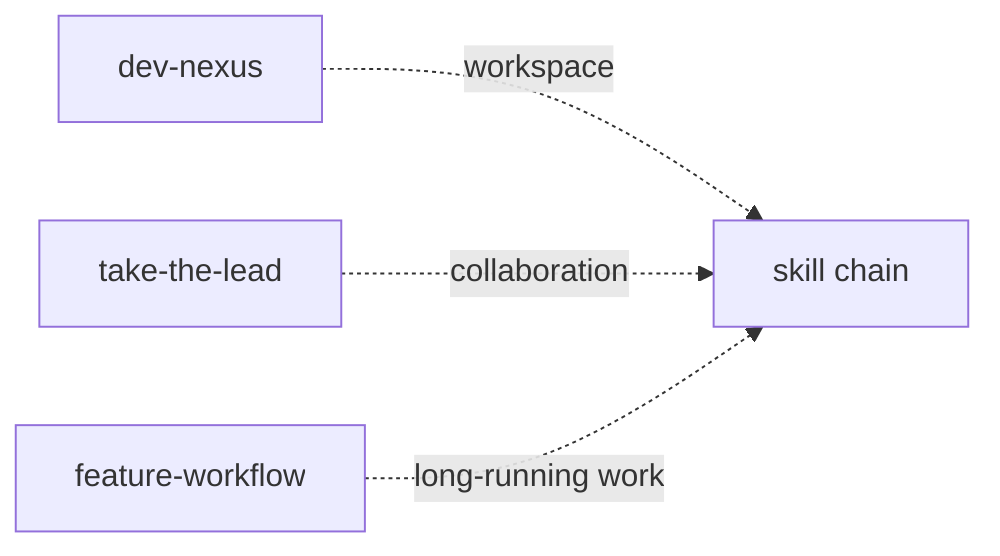
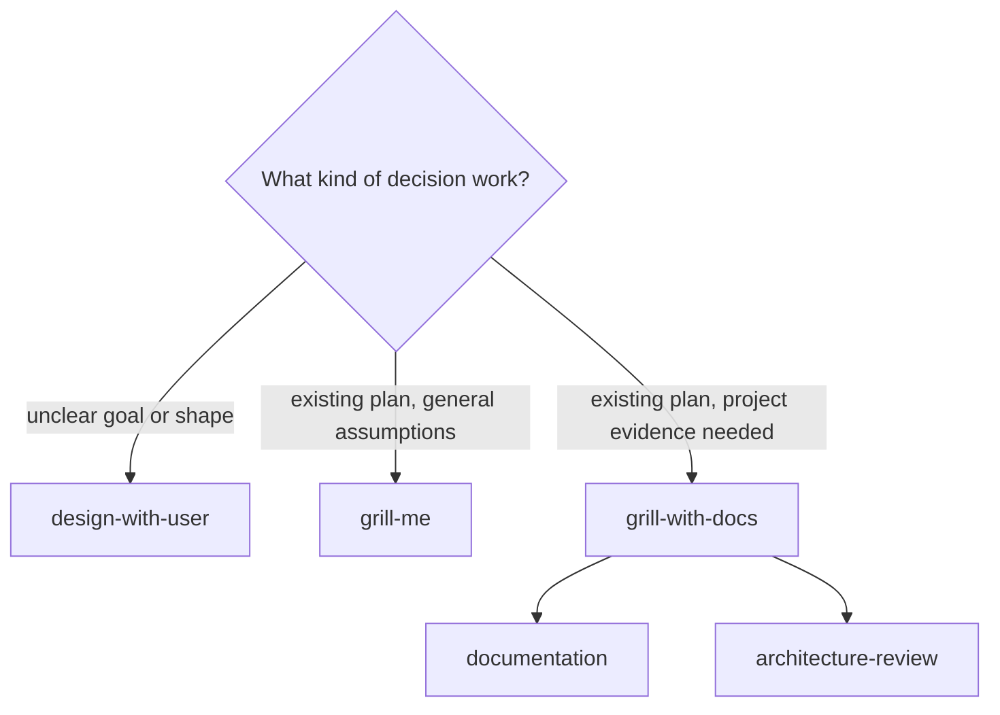
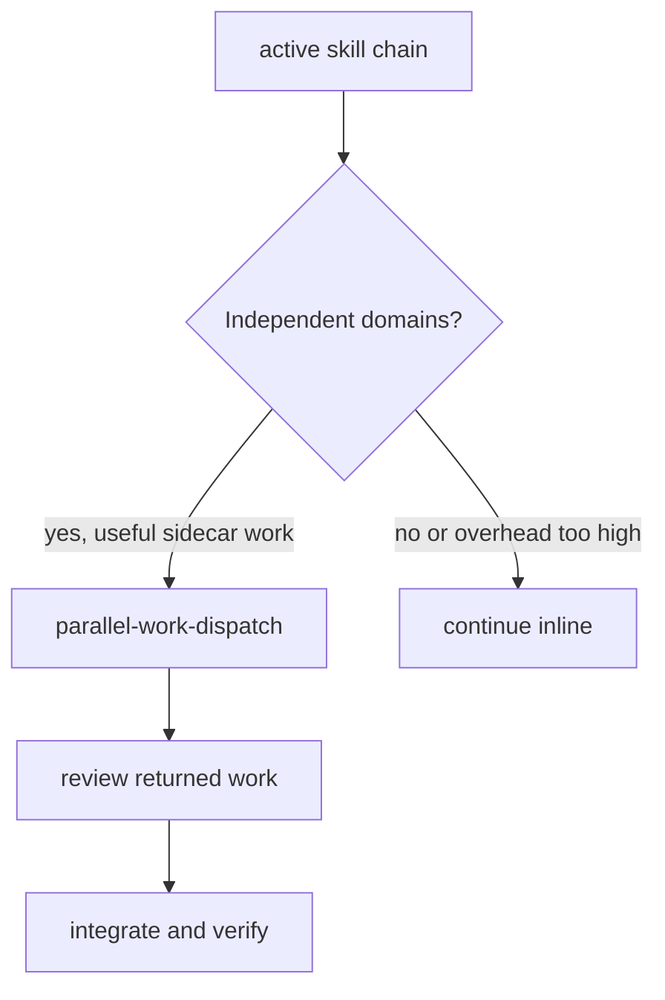
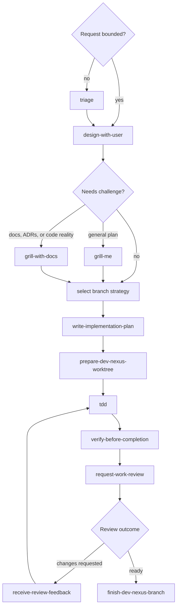
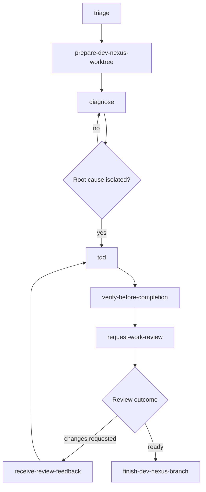
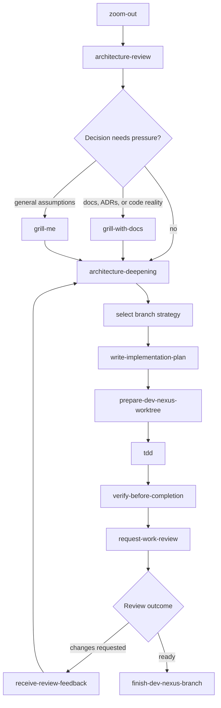
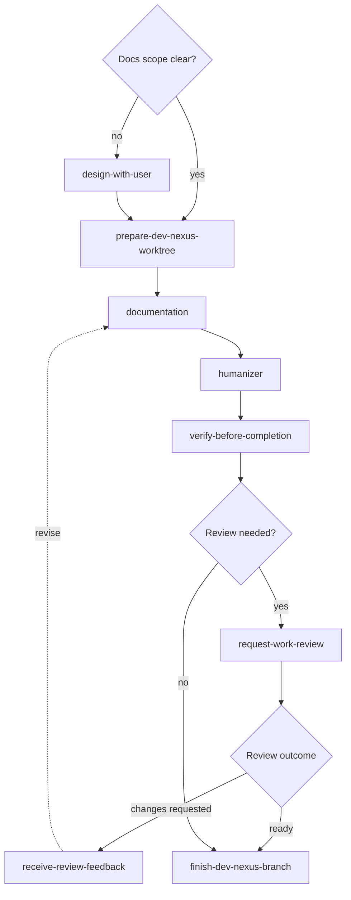
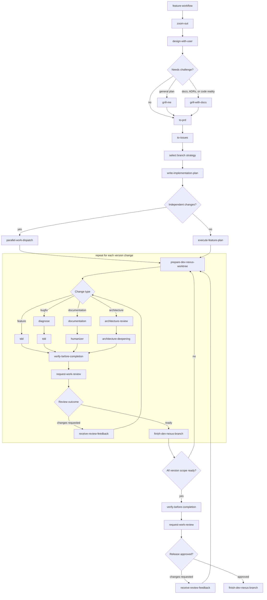

# Skill Chains

DevNexus skills should compose as workflow verbs. These workflow composition
diagrams show common skill chains, using skills as nodes and decisions as
diamonds. The diagrams are supporting maps; the skill text carries the compact
rules agents should follow when the diagrams are not rendered. `take-the-lead`
should actively route work through these chains instead of treating them as
background documentation.

Some skills are frames rather than phases: `dev-nexus` provides workspace
infrastructure, `take-the-lead` changes the collaboration contract while the
user keeps decision authority, and `feature-workflow` keeps a long-running
feature, bugfix, release, research project, or docs rewrite together across
reviewable changes.

Use the sizing vocabulary in [Concepts](concepts.md#work-sizing-terms) when a
chain needs to classify work. In this page, `change` means an independently
reviewable vertical increment, and `branch strategy` means the Git and review
route used by review branches.

The decision skills have distinct roles:

- `design-with-user` shapes unclear work collaboratively.
- `grill-me` stress-tests an existing plan by asking one decision-tree question
  at a time.
- `grill-with-docs` stress-tests an existing plan against code, glossary terms,
  domain docs, and Architecture Decision Records.

## Delegation Overlay

`parallel-work-dispatch` is an optional branch on any substantial chain, not a
separate workflow that only starts when the user says "subagents". Under
`take-the-lead`, the agent should decide whether delegation is useful after a
chain exposes independent domains.

Use `parallel-work-dispatch` when there are separate components, disjoint files,
separate tracker items, independent failures, or separate artifacts with clear
write scopes and verification paths. Skip it for small direct tasks, tightly
coupled edits, tasks blocked by one decision, or work that would force workers
into the same mutable files.

## Git Branch Strategies

For Git-backed features, choose the branch strategy before
`prepare-dev-nexus-worktree`. The strategy tells agents how review branches
reach the base branch or feature branch; it is separate from the feature
objective and tracker anchor.

Use the smallest strategy that preserves reviewability:

- Direct branch strategy: short-lived review branches or pull requests target
  the final target branch. This is the default when changes can land
  independently.
- Stacked branch strategy: dependent review branches target the branch below
  them and land bottom-up or retarget as dependencies land.
- Feature branch strategy: review branches target one approved long-lived
  feature branch. Use it only after human-in-the-loop (HITL) approval when
  partial publication would be incoherent or unsafe.
- Temporary integration branch strategy: ready branches meet temporarily for
  compatibility rehearsal. Do not base new work on that branch.
- Release train strategy: follow the workspace release policy instead of
  treating a release train as automatic permission to batch unrelated work.

```mermaid
flowchart TD
  A{"Git-backed feature?"}
  A -->|"no"| Artifact["choose artifact or tracker path"]
  A -->|"yes"| B{"Can changes land independently?"}
  B -->|"yes"| Direct["direct branch strategy"]
  B -->|"dependent sequence"| Stacked["stacked branch strategy"]
  B -->|"partial state unsafe"| Approval["HITL approval"]
  Approval --> Feature["feature branch strategy"]
  B -->|"compatibility rehearsal"| Temporary["temporary integration branch strategy"]
  Direct --> Worktree["prepare-dev-nexus-worktree"]
  Stacked --> Worktree
  Feature --> Worktree
  Temporary --> Verify["verify integration only"]
```

## Feature Implementation

Use this chain when the request changes behavior or adds a capability.

## Bugfix

Use this chain when the work starts from a failure, regression, or unexpected
behavior. The chain starts with diagnosis; the fix should not outrun the
reproduction.

## Architecture Change

Use this chain when the work changes boundaries, contracts, dependency
direction, or long-lived structure.

## Documentation Change

Use this chain when the output is user-facing or maintainer-facing prose.

## Plan To Published Version

Use this chain when a version, release train, or broad feature needs to move
from planning through multiple changes to a publishable result. The per-change
section expands each mode into separate skill nodes instead of hiding multiple
skills in one box.

