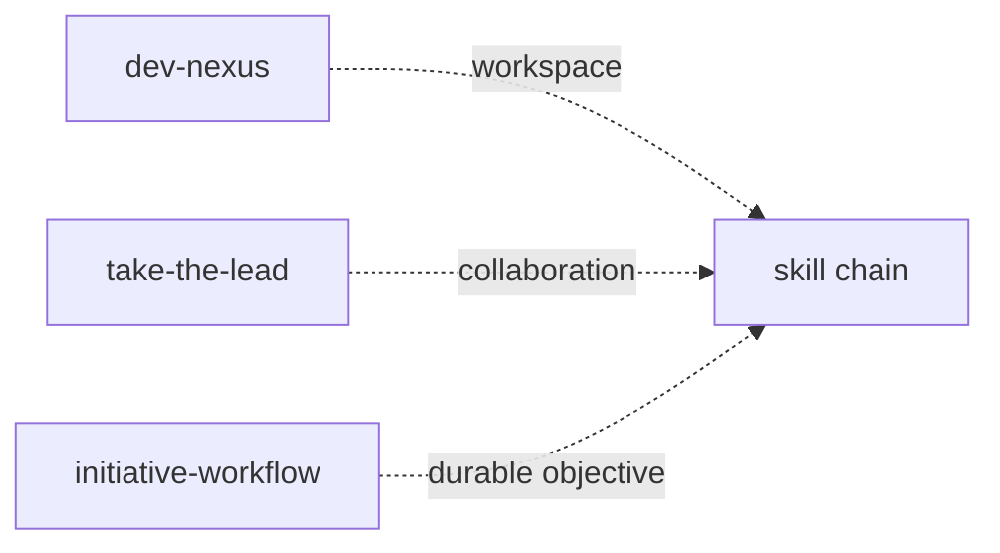
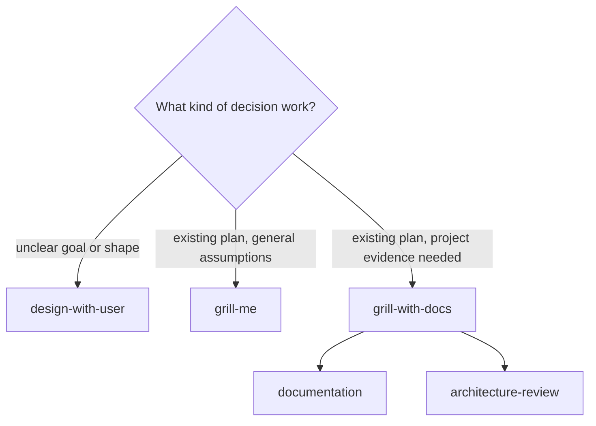
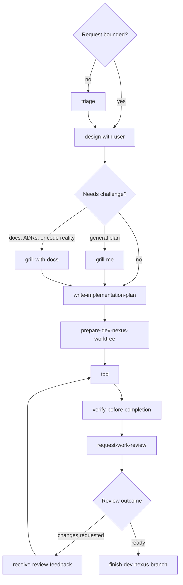
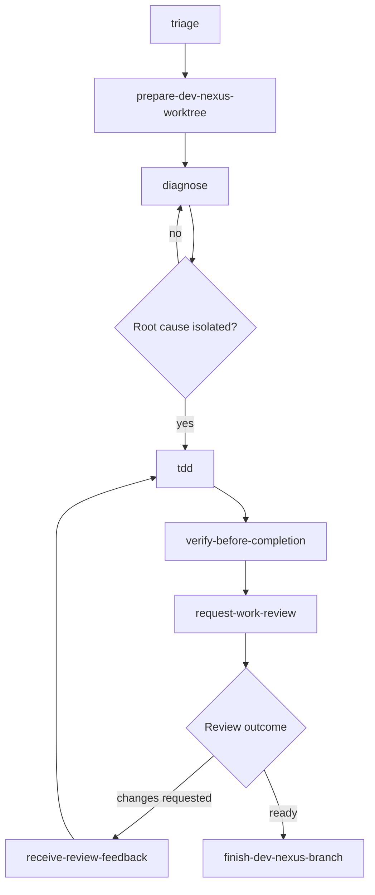
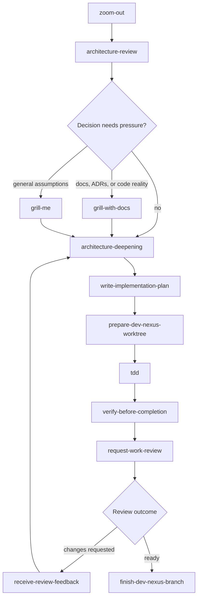
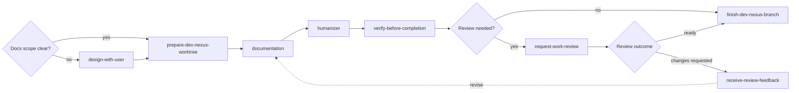
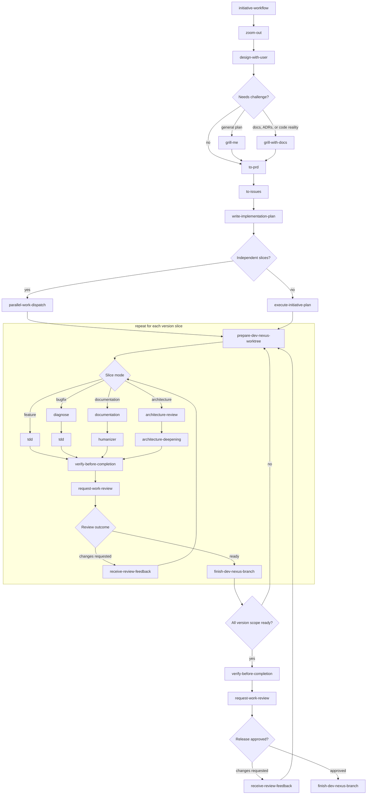

# Skill Chains

DevNexus skills should compose as workflow verbs. These workflow composition
diagrams show common skill chains, using skills as nodes and decisions as
diamonds. Some skills are frames rather than phases: `dev-nexus` provides
workspace infrastructure, `take-the-lead` changes the collaboration contract
while the user keeps decision authority, and `initiative-workflow` holds a
durable objective and integration surface across slices.

The decision skills have distinct roles:

- `design-with-user` shapes unclear work collaboratively.
- `grill-me` stress-tests an existing plan by asking one decision-tree question
  at a time.
- `grill-with-docs` stress-tests an existing plan against code, glossary terms,
  domain docs, and Architecture Decision Records.

## Feature Implementation

Use this chain when the request changes behavior or adds a capability.

## Bugfix

Use this chain when the work starts from a failure, regression, or unexpected
behavior. The chain starts with diagnosis; the fix should not outrun the
reproduction.

## Architecture Change

Use this chain when the work changes boundaries, contracts, dependency
direction, or long-lived structure.

## Documentation Change

Use this chain when the output is user-facing or maintainer-facing prose.

## Plan To Published Version

Use this chain when a version, release train, or broad initiative needs to move
from planning through multiple slices to a publishable result. The per-slice
section expands each mode into separate skill nodes instead of hiding multiple
skills in one box.

